Source: [5 reglas de COMPOSICIÓN FOTOGRÁFICA](https://www.youtube.com/watch?v=4OT4vj8mvY8&t) by [De Viaje con la Cámara](https://www.youtube.com/channel/UCUmIjelYFYFpOyBC-MRIE1Q)

## Rule of thirds
Use to emphasize the floor/sky on the photo, locating the border in the third lines. Remember the vertical lines could be also used.

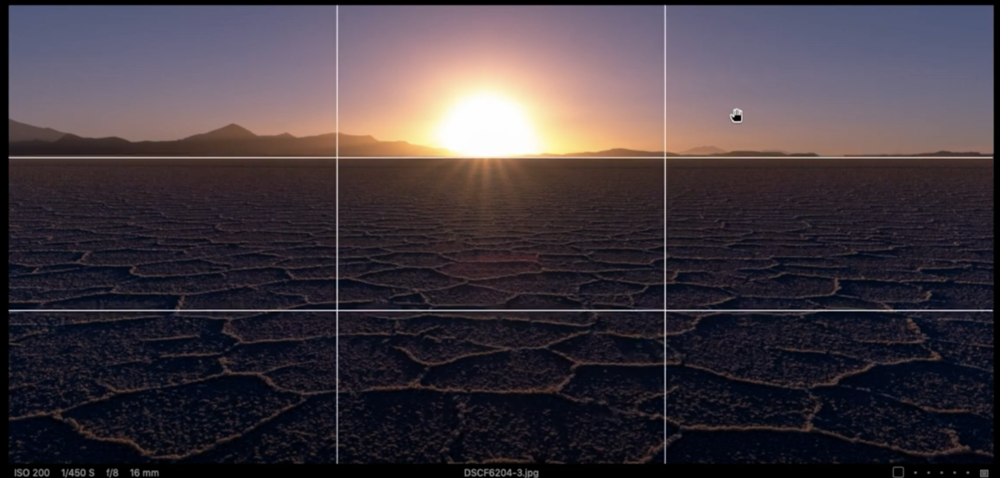

In these lines/points we can locate subjects and objects. Objects created by the lines created in the photo.

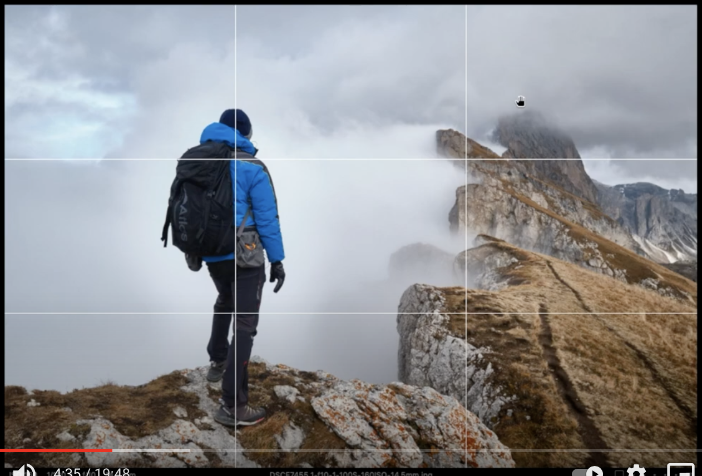

The intersection points (_power point_ or  _crash point_) creates more tension, energy and interest in the composition than simply centering the subject.

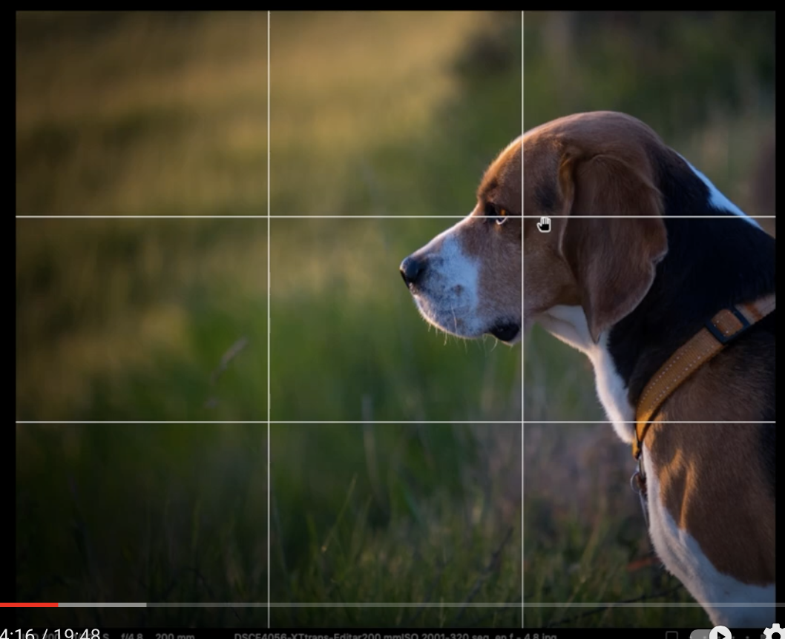

Locating the objects in opposite power points, it emphasizes the objects.

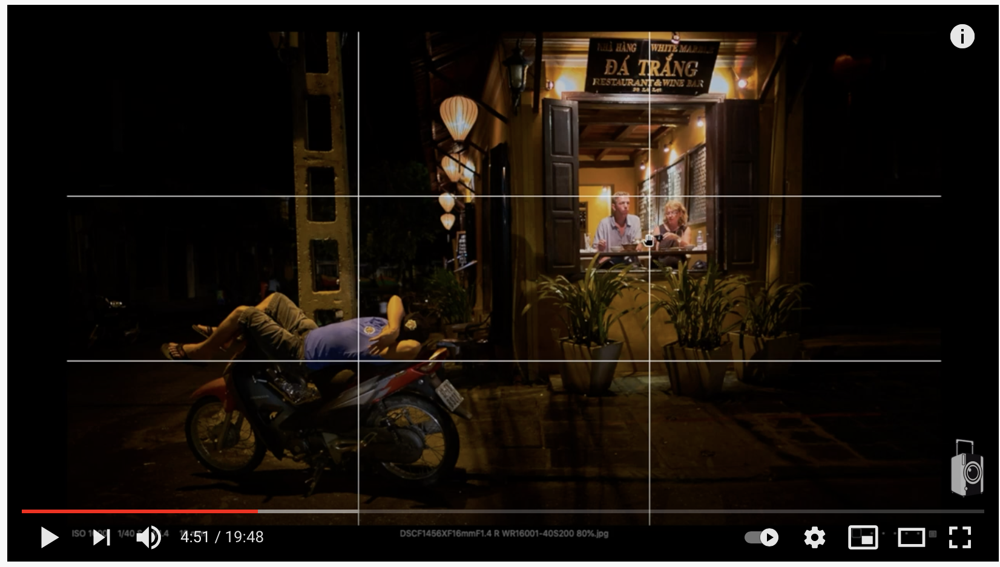

## Symmetry

It breaks the rule of thirds.

Very recommended for architecture, buildings and landscapes.

If we want to emphasize an object, we have to locate it to break the symmetry, normally in the center of it.

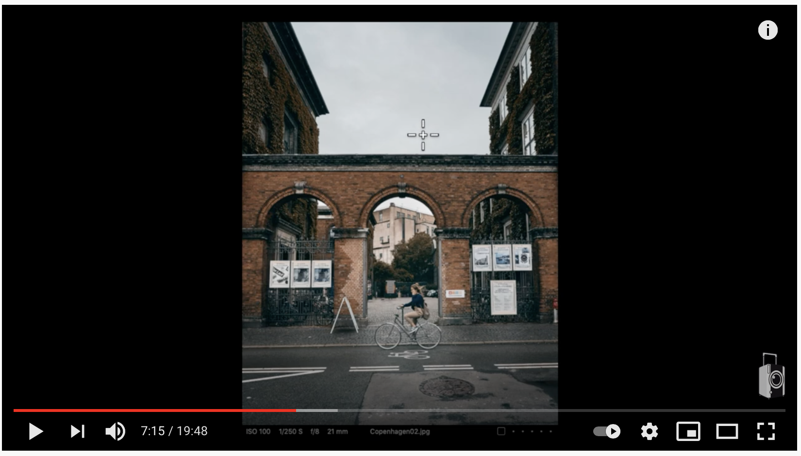

## Isolate elements

It breaks all previous rules. Is used when the object is already isolated. The idea is to locate the object/subject in the center of the image, isolate it from the rest of elements.

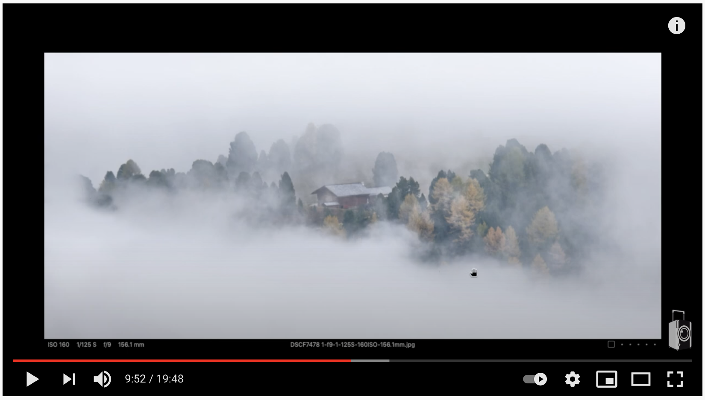

This rule can be used with the lines of the rule of thirds.

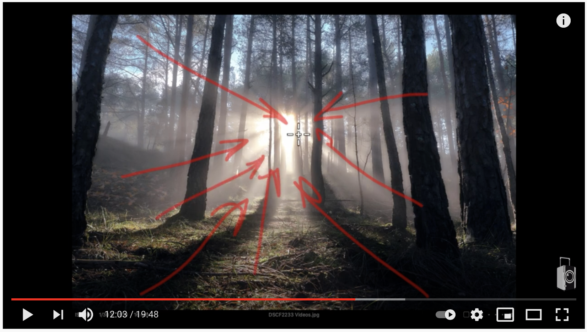

## Lines, vanishing points and roads
Using the line, roads and rivers to guide the photo to the vanishing points of the photo.

Very used in the landscapes, to guide it through the photo.

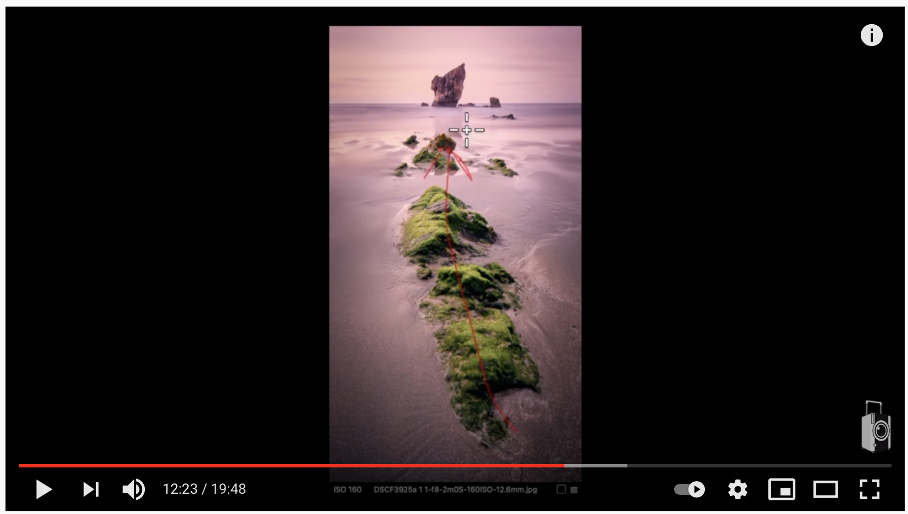

We can use the lines as a guide though the photo to the object we want to emphasize.

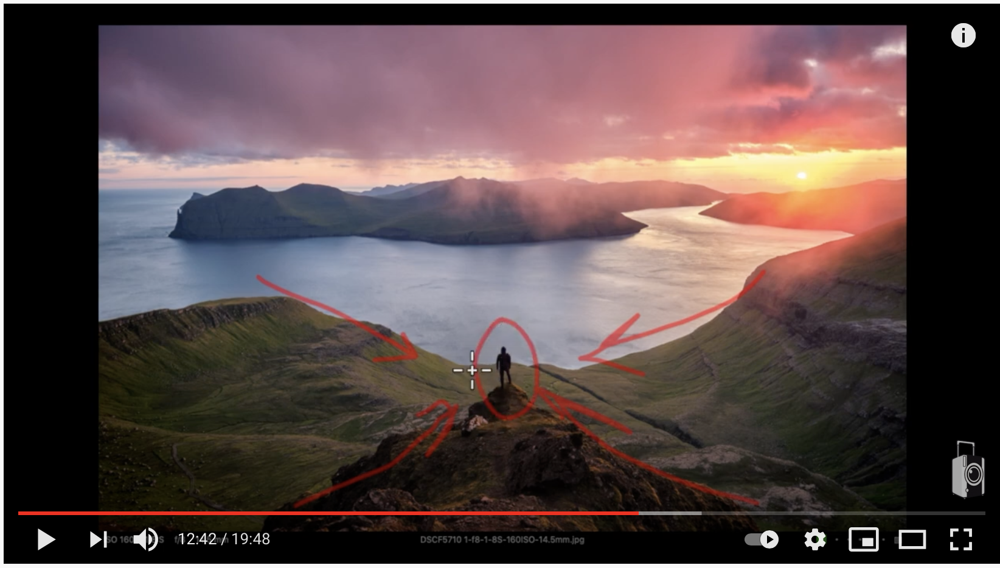

Use the roads as a guide to the vanishing point.

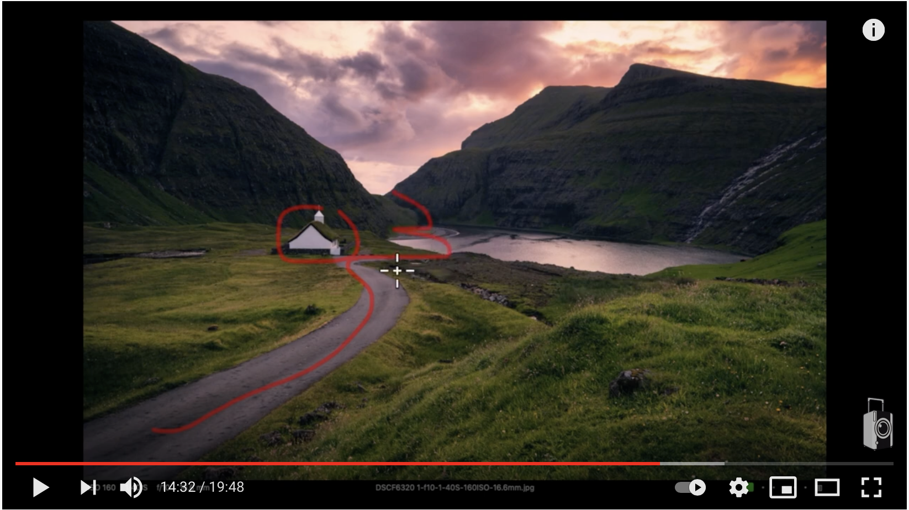

## Corners
Related with the previous point.

It consist with the idea of matching the lines/roads/rivers of the photo with the corners of it.

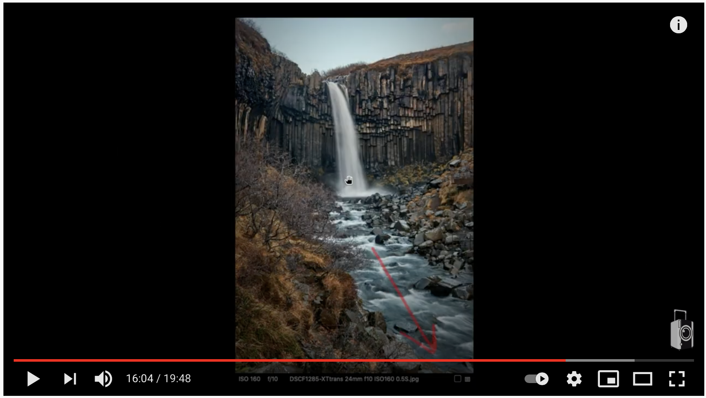